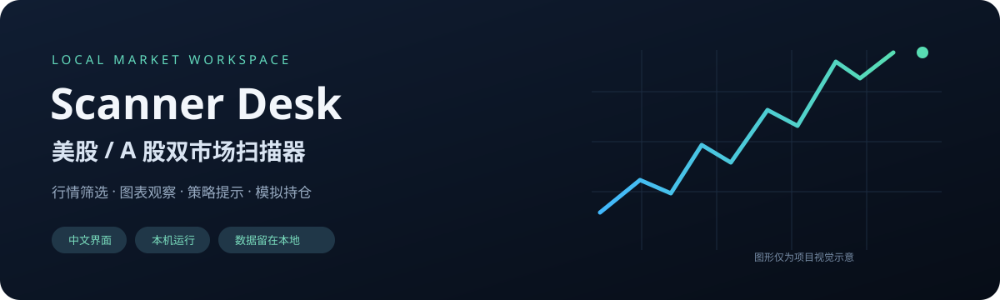
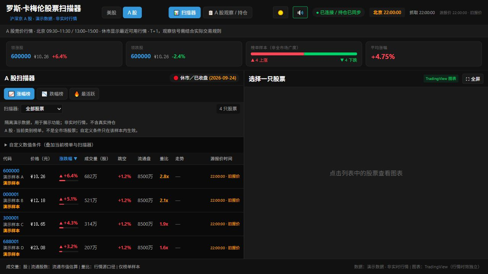
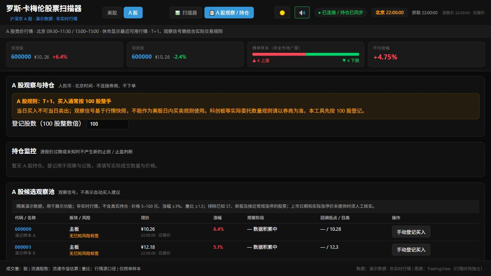

<div align="center">



# 美股 / A 股双市场扫描器

**把榜单、图表、策略观察和模拟持仓，放进一个中文工作台。**

[](https://github.com/cs0074152/ross-cameron-stock-scanner/actions/workflows/check.yml)


[项目介绍](https://cs0074152.github.io/ross-cameron-stock-scanner/) · [快速开始](#快速开始) · [功能预览](#功能预览) · [详细指南](docs/GUIDE.md) · [反馈问题](https://github.com/cs0074152/ross-cameron-stock-scanner/issues)

</div>

这是一个在本机运行的股票行情观察工具：在美股与沪深京 A 股之间切换，用清晰的数值条件缩小关注范围，再结合图表、报价时间和模拟持仓记录进行复盘。行情每 15 秒尝试刷新，中文界面支持深浅主题。

**行情榜单属于样本；策略是快照观察；所有买入与平仓按钮都是模拟记账，不连接券商，也不提交真实订单。** 本项目是 [Jayanth7416/ross-cameron-stock-scanner](https://github.com/Jayanth7416/ross-cameron-stock-scanner) 的中文双市场扩展，与 Ross Cameron、Warrior Trading 及行情提供方没有官方关联。

## 你可以用它做什么

| 场景 | 提供的能力 |
| --- | --- |
| 盘前筛选关注名单 | 涨幅、成交活跃、真实开盘跳空、量比与流通盘条件；缺失指标明确显示 |
| 美股与 A 股切换 | 美股美元 / 美东时间；A 股人民币 / 北京时间，独立规则和涨跌颜色 |
| 观察价格结构 | TradingView 图表、接近日高筛选、价格样本趋势和买点雷达 |
| 记录模拟持仓 | 入场、止损、目标、峰值与报价状态；重启后恢复，重复平仓不会重复记账 |
| 复盘与风险观察 | 分市场、按交易日期归档盈亏；A 股模拟持仓显示 T+1 与板块信息 |

## 功能预览

### A 股扫描器



### 策略与模拟持仓



截图使用隔离的演示数据，展示界面功能，不是实时行情、真实持仓或交易建议。外部图表的行情时效独立于扫描器。

## 快速开始

### 1. 获取项目

下载 [ZIP 源码](https://github.com/cs0074152/ross-cameron-stock-scanner/archive/refs/heads/main.zip) 并解压，或使用 Git：

```bash
git clone https://github.com/cs0074152/ross-cameron-stock-scanner.git
cd ross-cameron-stock-scanner
```

需要 **Node.js ≥22.12.0 和 npm**，建议安装 [Node.js 24](https://nodejs.org/)。首次启动需要联网下载依赖；以后源码不变时使用构建缓存。

### 2. 启动

| 系统 | 启动方式 |
| --- | --- |
| Windows | 双击项目目录中的 `start.bat` |
| macOS / Linux / Git Bash | 在项目目录执行 `bash start.sh` |

启动器安装缺失依赖、准备生产页面，并核对前后端是否真正就绪。Windows 会自动用默认浏览器打开；其他系统按启动窗口显示的地址打开浏览器。

默认页面是 `http://localhost:5173`。遇到端口占用会选择空闲本机端口，**以启动窗口的实际地址为准**。重复点击会打开已验证的实例；按 `Ctrl+C` 停止本次启动的服务。

### 3. 可选：Windows 桌面入口

双击 `create-desktop-shortcut.bat`，生成“美股与A股扫描器”桌面图标。快捷方式使用当前项目路径；移动项目后重新生成。这个入口不需要管理员权限，不配置开机自启。

### 4. 开始观察

1. 选择“美股”或“A 股”，再选择榜单类别。
2. 调整价格、涨幅、量比和流通股数条件；筛选范围仅为当前样本。
3. 点击股票查看图表；进入策略中心阅读观察说明和风险提示。
4. 手动登记模拟持仓，检查报价时间，再记录模拟平仓和复盘结果。

## 为什么打开更快

桌面入口使用预构建页面，源文件不变时复用经过完整性校验的缓存；页面资源压缩传输，策略中心按需加载。成功返回的榜单先显示，再补齐独立报价和额外指标，减少无关等待。

2026-10-08 的 Windows / Node 24 本机测量：缓存启动约 **0.86 秒**，现有实例识别约 **0.27 秒**，核心首屏资源约 **63 KB** 压缩传输量。它们是服务就绪与本机 HTTP 指标，**不包含浏览器启动、首屏绘制、首次依赖安装和外部图表加载**，不同设备结果会变化。方法与边界见 [性能说明](docs/PERFORMANCE.md)。

## 行情来源与数据边界

| 数据 | 来源 | 范围与限制 |
| --- | --- | --- |
| 美股盘中 / 闭市参考 | Yahoo Finance | 三类预设榜单，各最多 200 条；不是全市场扫描 |
| 美股盘前 / 盘后 | StockAnalysis | 独立时段页面；缺少精确报价时间时仅作参考，盘后没有可靠活跃榜时为空 |
| 沪深京 A 股 | 东方财富 | 涨幅、跌幅、成交活跃三榜；流通股数由流通市值 / 价格估算 |
| 独立报价 | Yahoo / 东方财富 | 持仓和选中股票可在退出榜单后继续查询 |
| 图表 | TradingView | 由浏览器加载外部组件；部分股票不支持，北交所提供备用行情链接 |

缺失指标显示“—”；数据源失败会保留最后有效数据并提示。源报价时间与抓取成功时间分别展示。报价未知或过期时，模拟持仓会停止新的监控判断，不把旧价格当作当前成交价。

本工具未接入 Level 2 盘口、逐笔成交、新闻验证或券商订单。雷达基于报价快照，不能代替真实 K 线或人工看盘；未扣手续费的模拟盈亏不代表实际收益。

## 常见问题

<details>
<summary>是否需要申请行情 API Key？</summary>

当前实现不需要你填写商业行情 API Key。公开数据源仍可能延迟、限流或调整接口，使用时应遵守数据提供方的条款。
</details>

<details>
<summary>打开后暂时没有行情怎么办？</summary>

先确认页面连接状态，再查看数据源错误和报价时间。休市、公开接口限流或网络不通都可能导致等待；连接成功本身不代表报价已经更新。不要将过期报价用于实际交易决策。
</details>

<details>
<summary>持仓数据在哪里？换浏览器会丢失吗？</summary>

后端持仓默认保存到 `backend/data/positions.json`，换浏览器会与本机后端重新对账。浏览器还保存分市场的显示设置和盈亏镜像。迁移到另一台电脑前先停止服务，再备份持仓文件；源码 ZIP 和 Git 仓库不包含私人持仓。
</details>

<details>
<summary>能放到公网服务器供多人使用吗？</summary>

当前版本面向本机单用户，服务仅允许回环地址。GitHub Pages 承载的是项目介绍，不是扫描器后台。多用户部署需要另行设计认证、权限及数据隔离。
</details>

<details>
<summary>源码更新后仍显示旧版本怎么办？</summary>

先停止原启动窗口中的服务，再重新双击 `start.bat`。启动器会根据源码变化重建页面，不会为了更新而强制结束用户现有进程。
</details>

## 开发与验证

前端 React 18 / Vite，后端 Node.js / Express / WebSocket，持仓使用本机原子 JSON 文件。详细结构、配置、筛选规则和 API 见 [完整指南](docs/GUIDE.md)。

```bash
# 后端
cd backend
npm ci
npm test
npm audit

# 前端（从项目根目录进入）
cd ../frontend
npm ci
npm test
npm run build
npm audit
```

开发时可在两个终端分别运行 `backend: npm run dev` 和 `frontend: npm run dev -- --strictPort`。GitHub Actions 在 Node 22 / 24 上执行测试、构建和依赖审计。发布前验证记录为 **后端 138 项 + 前端 20 项**。

## 参与与来源

欢迎通过 [Issue](https://github.com/cs0074152/ross-cameron-stock-scanner/issues) 提交问题和建议，修改前请阅读 [贡献指南](CONTRIBUTING.md)。安全问题请遵循 [安全说明](SECURITY.md)，不要在公开 Issue 上传 `.env`、持仓文件或敏感日志。

基于原作者 **Jayanth7416** 的扫描器项目扩展，保留上游历史与出处。上游 README 声明 MIT 许可，本仓库补齐 [MIT 许可文本](LICENSE)，来源与修改说明见 [NOTICE](NOTICE.md)。感谢 React、Node.js、TradingView 和行情来源提供的基础能力。
